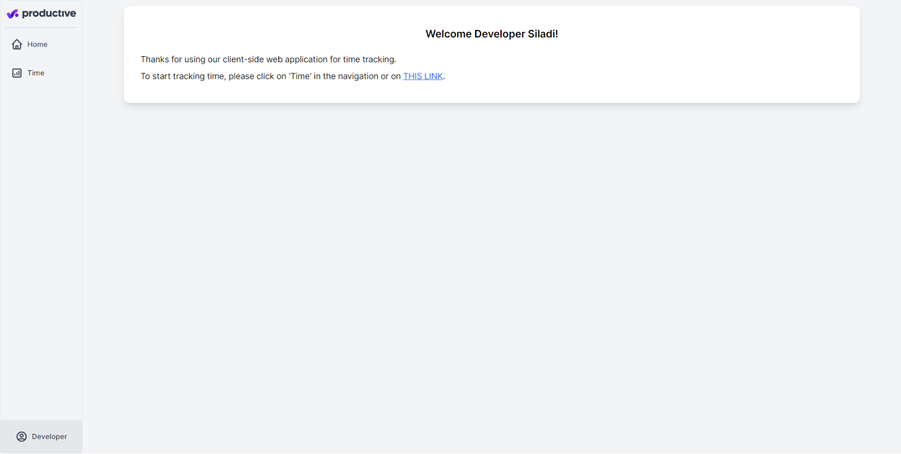
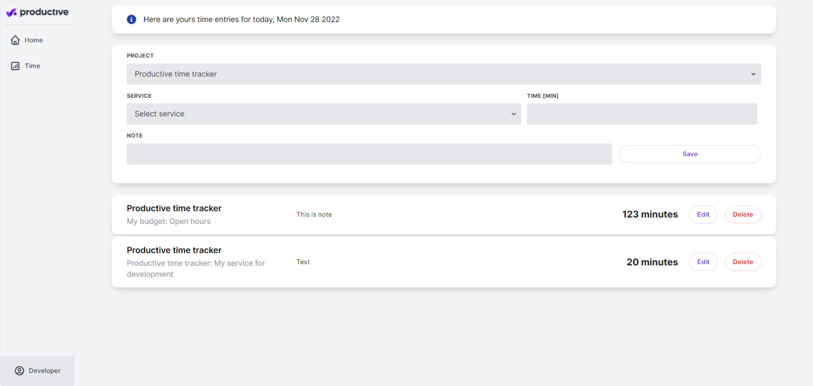
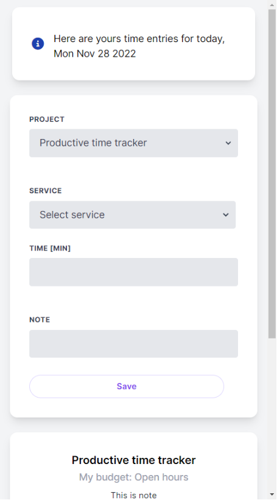
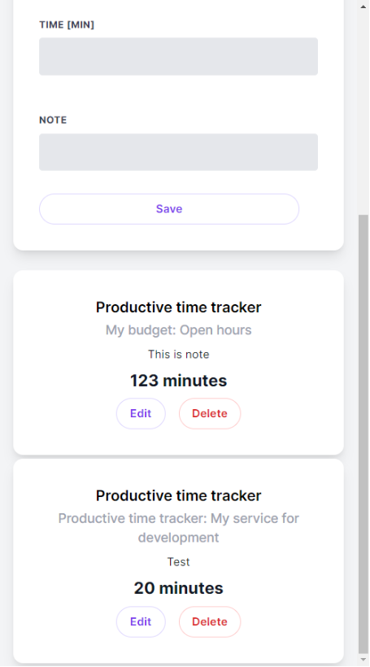

<a name="readme-top"></a>

<!-- PROJECT LOGO -->
<br />
<div align="center">
  <a href="https://github.com/siladikarlo856/productive-time-tracker">
    
  </a>

<h3 align="center">Productive time tracker</h3>

  <p align="center">
    Client-side web application for tracking time
    <br />
    <a href="https://github.com/siladikarlo856/productive-time-tracker"><strong>Explore the docs »</strong></a>
    <br />
    <br />
    <a href="https://reliable-sopapillas-f0ccfd.netlify.app/">View Demo</a>
    ·
    <a href="https://github.com/siladikarlo856/productive-time-tracker/issues">Report Bug</a>
    ·
    <a href="https://github.com/siladikarlo856/productive-time-tracker/issues">Request Feature</a>
  </p>
</div>

<!-- TABLE OF CONTENTS -->
<details>
  <summary>Table of Contents</summary>
  <ol>
    <li>
      <a href="#about-the-project">About The Project</a>
      <ul>
        <li><a href="#built-with">Built With</a></li>
      </ul>
    </li>
    <li>
      <a href="#getting-started">Getting Started</a>
      <ul>
        <li><a href="#prerequisites">Prerequisites</a></li>
        <li><a href="#installation">Installation</a></li>
      </ul>
    </li>
    <li><a href="#Continued development">Continued development</a></li>
    <li><a href="#contact">Contact</a></li>
    <li><a href="#acknowledgments">Acknowledgments</a></li>
  </ol>
</details>

<!-- ABOUT THE PROJECT -->

## About The Project

Live Site URL: [https://reliable-sopapillas-f0ccfd.netlify.app/](https://reliable-sopapillas-f0ccfd.netlify.app/)

### Requirements

Create Productive time tracker app with CR(U)D for today's time entries. Data will be stored and fetched from Productive API. Access to API is done through Settings > API access in Productive app. The app source code shall be in public git repo.

#### Features:

- view with entries for today
- add new time entry
  - duration
  - description
- delete existing time entry

<p align="right">(<a href="#readme-top">back to top</a>)</p>

### Home screen on desktop



### Time tracking screen on desktop



### Time tracking screen on mobile




### Built With

- Vue3 and TypeScript
- Tailwind CSS
- Vue Router - Routing
- Axios - HTTP requests
- Eslint and Prettier - code style
- Pinia store - State management
- Mocha and Chai - unit testing
- Netlify

<p align="right">(<a href="#readme-top">back to top</a>)</p>

<!-- GETTING STARTED -->

## Getting Started

This is an example of how you may give instructions on setting up your project locally.
To get a local copy up and running follow these simple example steps.

### Prerequisites

This is an example of how to list things you need to use the software and how to install them.

- Install [node.js](https://nodejs.org/en/) and npm

- npm
  ```sh
  npm install npm@latest -g
  ```

### Installation

1. Clone the repo
   ```sh
   git clone https://github.com/siladikarlo856/productive-time-tracker.git
   ```
2. Install NPM packages
   ```sh
   npm install
   ```
3. Run web development
   ```sh
   npm start
   ```
4. Open [http://localhost:8080/](http://localhost:8080/) in web-browser

<p align="right">(<a href="#readme-top">back to top</a>)</p>

<!-- Continued development -->

## Continued development

### Improvements

- code refactoring
  - use classes for DTO data structure with shared logic
- UI (layout) for mobile device
- Loading animation and user messages for better UX

### New Features

- Authorization
- Edit mode
- Project selection
- E2E testing

<p align="right">(<a href="#readme-top">back to top</a>)</p>

<!-- CONTACT -->

## Contact

- LinkedIn - [Karlo Siladi](https://www.linkedin.com/in/karlosiladi/)
- Frontend Mentor - [@siladikarlo856](https://www.frontendmentor.io/profile/siladikarlo856)
- CodePen - [@developersiladi](https://codepen.io/developersiladi/)
- freeCodeCamp - [@developersiladi](https://www.freecodecamp.org/developersiladi)

<p align="right">(<a href="#readme-top">back to top</a>)</p>

<!-- ACKNOWLEDGMENTS -->

## Acknowledgments

- [Fullstack Vue3](https://www.newline.co/vue) - The Complete Guide to Vue.js by Hassan Djirdeh
- [MDN Web Docs](https://developer.mozilla.org/en-US/) - Documenting web technologies, including CSS, HTML, and JavaScript.
- [W3 schools](https://www.w3schools.com/)
- [https://v1.tailwindcss.com/components/cards](https://v1.tailwindcss.com/components/cards)

- [https://larainfo.com/blogs/tailwind-css-loading-button-example](https://larainfo.com/blogs/tailwind-css-loading-button-example)
- [https://codesandbox.io/s/trusting-estrela-8em53y?file=/index.html](https://codesandbox.io/s/trusting-estrela-8em53y?file=/index.html)

- [https://codepen.io/robstinson/pen/bGwpNMV](https://codepen.io/-robstinson/pen/bGwpNMV)

- [https://v1.tailwindcss.com/components/forms](https://v1.tailwindcss.com/components/forms)

- [https://tailwindcss.com/docs/text-align#setting-the-text-alignment](https://tailwindcss.com/docs/text-align#setting-the-text-alignment)

- [https://v1.tailwindcss.com/components/cards](https://v1.tailwindcss.com/components/cards)

- [https://tailwindcss.com/docs/screens](https://tailwindcss.com/docs/screens)

- [https://fontawesome.com/icons](https://fontawesome.com/icons)

- [https://cdnjs.com/libraries/font-awesome](https://cdnjs.com/libraries/font-awesome)

- [https://tailwindcss.com/docs/font-family](https://tailwindcss.com/docs/font-family)

- [https://fontawesome.com/icons/triangle-exclamation?s=solid&f=classic](https://fontawesome.com/icons/triangle-exclamation?s=solid&f=classic)

<p align="right">(<a href="#readme-top">back to top</a>)</p>

<!-- MARKDOWN LINKS & IMAGES -->
<!-- https://www.markdownguide.org/basic-syntax/#reference-style-links -->

[contributors-shield]: https://img.shields.io/github/contributors/siladikarlo856/productive-time-tracker.svg?style=for-the-badge
[contributors-url]: https://github.com/siladikarlo856/productive-time-tracker/graphs/contributors
[forks-shield]: https://img.shields.io/github/forks/siladikarlo856/productive-time-tracker.svg?style=for-the-badge
[forks-url]: https://github.com/siladikarlo856/productive-time-tracker/network/members
[stars-shield]: https://img.shields.io/github/stars/siladikarlo856/productive-time-tracker.svg?style=for-the-badge
[stars-url]: https://github.com/siladikarlo856/productive-time-tracker/stargazers
[issues-shield]: https://img.shields.io/github/issues/siladikarlo856/productive-time-tracker.svg?style=for-the-badge
[issues-url]: https://github.com/siladikarlo856/productive-time-tracker/issues
[license-shield]: https://img.shields.io/github/license/siladikarlo856/productive-time-tracker.svg?style=for-the-badge
[license-url]: https://github.com/siladikarlo856/productive-time-tracker/blob/master/LICENSE.txt
[linkedin-shield]: https://img.shields.io/badge/-LinkedIn-black.svg?style=for-the-badge&logo=linkedin&colorB=555
[linkedin-url]: https://linkedin.com/in/linkedin_username
[product-screenshot]: images/screenshot.png
[next.js]: https://img.shields.io/badge/next.js-000000?style=for-the-badge&logo=nextdotjs&logoColor=white
[next-url]: https://nextjs.org/
[react.js]: https://img.shields.io/badge/React-20232A?style=for-the-badge&logo=react&logoColor=61DAFB
[react-url]: https://reactjs.org/
[vue.js]: https://img.shields.io/badge/Vue.js-35495E?style=for-the-badge&logo=vuedotjs&logoColor=4FC08D
[vue-url]: https://vuejs.org/
[angular.io]: https://img.shields.io/badge/Angular-DD0031?style=for-the-badge&logo=angular&logoColor=white
[angular-url]: https://angular.io/
[svelte.dev]: https://img.shields.io/badge/Svelte-4A4A55?style=for-the-badge&logo=svelte&logoColor=FF3E00
[svelte-url]: https://svelte.dev/
[laravel.com]: https://img.shields.io/badge/Laravel-FF2D20?style=for-the-badge&logo=laravel&logoColor=white
[laravel-url]: https://laravel.com
[bootstrap.com]: https://img.shields.io/badge/Bootstrap-563D7C?style=for-the-badge&logo=bootstrap&logoColor=white
[bootstrap-url]: https://getbootstrap.com
[jquery.com]: https://img.shields.io/badge/jQuery-0769AD?style=for-the-badge&logo=jquery&logoColor=white
[jquery-url]: https://jquery.com
